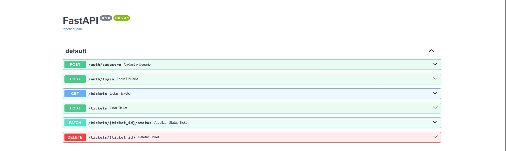

# 🛠️ HelpDesk Simples

API REST para gerenciamento de tickets de suporte técnico, desenvolvida com **FastAPI**, **SQLAlchemy** e **PostgreSQL**.

Este projeto foi criado com foco em aprendizado de desenvolvimento Back-end utilizando Python, aplicando conceitos de arquitetura em camadas, autenticação JWT e boas práticas de organização de código.

---

# 🚀 Tecnologias

- Python 3.13
- FastAPI
- SQLAlchemy
- PostgreSQL (Neon)
- Pydantic
- Uvicorn
- python-jose (JWT)
- bcrypt

---

# 🏗️ Arquitetura

O projeto segue uma arquitetura em camadas, separando as responsabilidades da aplicação para facilitar manutenção, escalabilidade e organização do código.

```text
Cliente
    │
    ▼
Router
    │
    ▼
Service
    │
    ▼
Repository
    │
    ▼
PostgreSQL
```

### Responsabilidade de cada camada

- **Router:** recebe as requisições HTTP e direciona para a camada de serviço.
- **Service:** contém toda a lógica de negócio da aplicação.
- **Repository:** realiza todas as operações de acesso ao banco de dados.
- **Models:** representam as tabelas do banco.
- **Schemas:** validam os dados de entrada e saída da API.

---

# 📋 Funcionalidades

- ✅ Cadastro de usuários
- ✅ Login utilizando JWT
- ✅ Criação de tickets
- ✅ Listagem de tickets
- ✅ Atualização do status dos tickets
- ✅ Exclusão de tickets
- ✅ Persistência utilizando PostgreSQL (Neon)

---

# 🖥️ Endpoints

| Método | Endpoint | Descrição |
|---------|----------|-----------|
| POST | `/auth/cadastro` | Cadastro de usuário |
| POST | `/auth/login` | Login e geração do token JWT |
| POST | `/tickets` | Criar novo ticket |
| GET | `/tickets` | Listar tickets |
| PATCH | `/tickets/{id}/status` | Atualizar status do ticket |
| DELETE | `/tickets/{id}` | Excluir ticket |

---

# 📂 Estrutura do Projeto

```text
app/
│
├── models/
│   ├── models.py
│   └── users.py
│
├── schemas/
│
├── routers/
│   ├── auth_router.py
│   └── ticket_router.py
│
├── services/
│   └── ticket_service.py
│
├── repositories/
│   └── ticket_repository.py
│
├── auth.py
├── database.py
└── main.py
```

---

# 📸 Preview

## Documentação (Swagger)



## Banco de Dados (Neon)


---

# ⚙️ Executando o projeto

## Clone o repositório

```bash
git clone https://github.com/vyctorrodrigues/helpdesk_simples.git
```

Entre na pasta do projeto

```bash
cd helpdesk_simples
```

Crie um ambiente virtual

```bash
python -m venv .venv
```

Ative o ambiente virtual

### Windows

```bash
.venv\Scripts\activate
```

Instale as dependências

```bash
pip install -r requirements.txt
```

Crie um arquivo `.env` na raiz do projeto

Copie o arquivo `.env.example` para `.env` e preencha os valores:

```bash
cp .env.example .env

Execute a aplicação

```bash
uvicorn app.main:app --reload
```

Acesse a documentação da API

```
http://127.0.0.1:8000/docs
```

---

# ☁️ Infraestrutura AWS & CI/CD (DevOps)

Além do desenvolvimento da API, a aplicação foi empacotada e implantada em uma infraestrutura resiliente, segura e automatizada na nuvem AWS.

---

### 🏛️ Arquitetura de Nuvem

* **Servidor de Aplicação:** Instância **AWS EC2 (Ubuntu 24.04 LTS)** rodando a API via **Uvicorn** gerenciado como um serviço do sistema (**systemd**), garantindo alta disponibilidade e reinício automático.
* **Proxy Reverso:** **Nginx** atuando na camada frontal para gerenciar as requisições, tratar conexões de rede e repassar o tráfego para a aplicação em `127.0.0.1:8000`.
* **DNS & Criptografia:** Apontamento de domínio público via **DuckDNS** (`helpdesk-vyctor.duckdns.org`) com suporte a **HTTPS/TLS** e renovação automática de certificado gerenciada pelo **Certbot (Let's Encrypt)**.

---

### 🔒 Hardening & Práticas de Segurança

* **Isolamento de Portas:** A porta nativa do FastAPI (`8000`) foi bloqueada no Security Group da AWS e restrita ao acesso local, permitindo tráfego externo exclusivamente pelas portas padrão web **80 (HTTP)** e **443 (HTTPS)**.
* **Redirecionamento Seguro:** Nginx configurado para forçar todo o tráfego HTTP para HTTPS automaticamente.
* **Gestão de Segredos:** Restrição de permissões de leitura do arquivo `.env` no servidor (`chmod 600`), garantindo acesso exclusivo ao usuário do sistema.
* **Privilégios Mínimos:** Ajuste fino nas regras do `sudoers` na EC2, liberando execução sem senha unicamente para a instrução de reinício do serviço (`systemctl restart helpdesk`).

---

### 🚀 Esteira de CI/CD (GitHub Actions)

Automação do fluxo de deploy contínuo configurada via `.github/workflows/deploy.yml`. A cada `push` na branch `main`:

1. O **GitHub Actions** dispara o job automatizado em um ambiente virtualizado.
2. Uma conexão criptografada via **SSH** é estabelecida com a instância EC2 utilizando chaves armazenadas no **GitHub Secrets** (`EC2_HOST`, `EC2_USERNAME`, `EC2_SSH_KEY`).
3. O servidor navega até a pasta do projeto e atualiza o código fonte (`git pull origin main`).
4. O ambiente virtual Python é ativado e as novas dependências do `requirements.txt` são instaladas.
5. O serviço `helpdesk` é reiniciado de forma transparente via `systemd` sem indisponibilidade perceptível.

---

# 👨‍💻 Autor

**Vyctor Rodrigues**

Estudante de Análise e Desenvolvimento de Sistemas, apaixonado por desenvolvimento Back-end e arquitetura de software.

GitHub:
https://github.com/vyctorrodrigues
